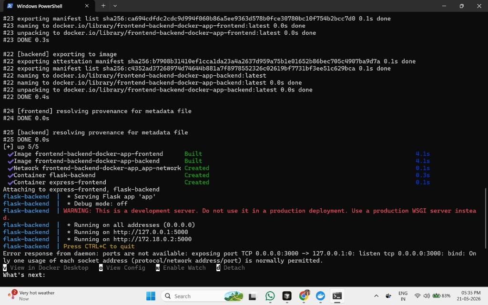
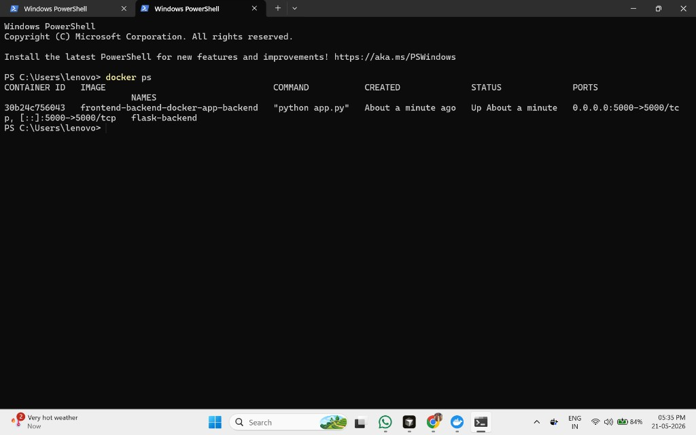
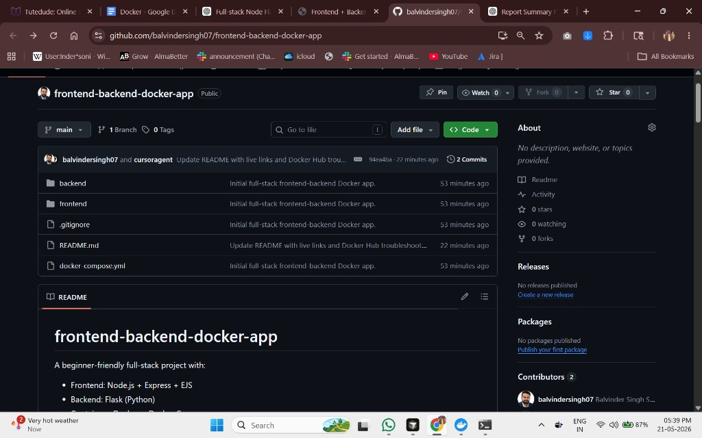
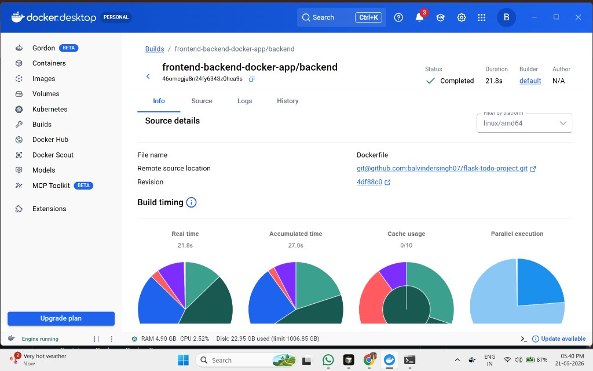
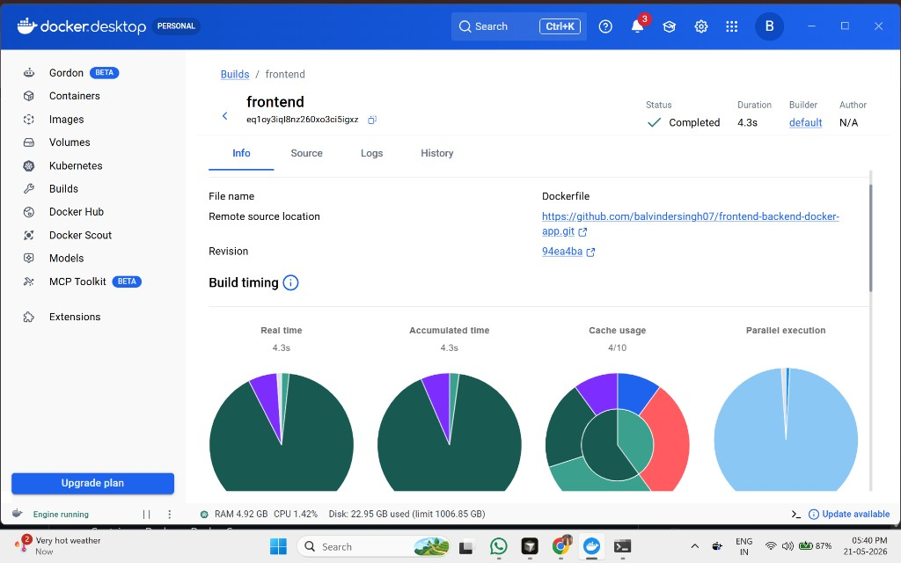
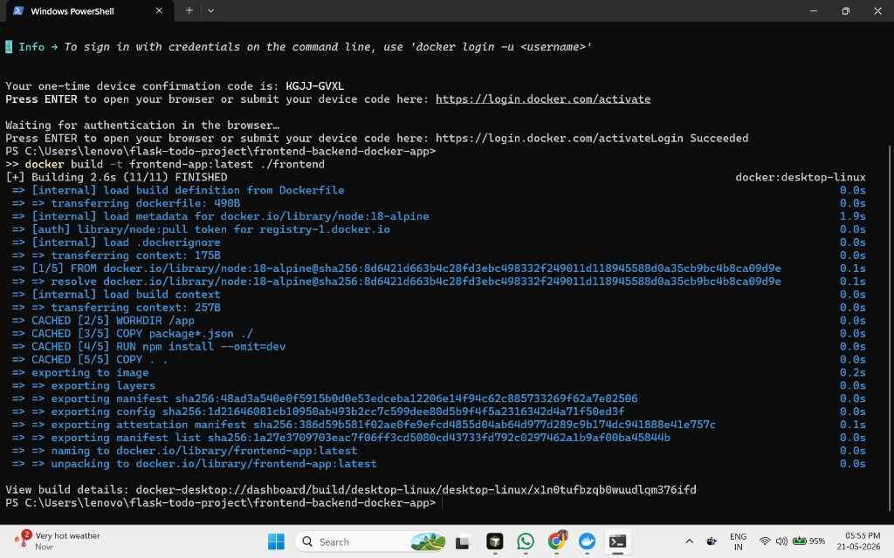
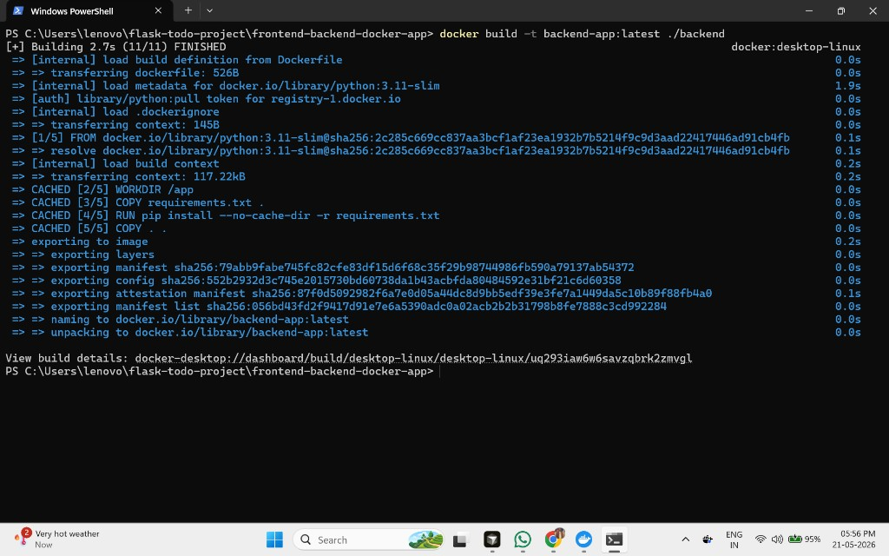
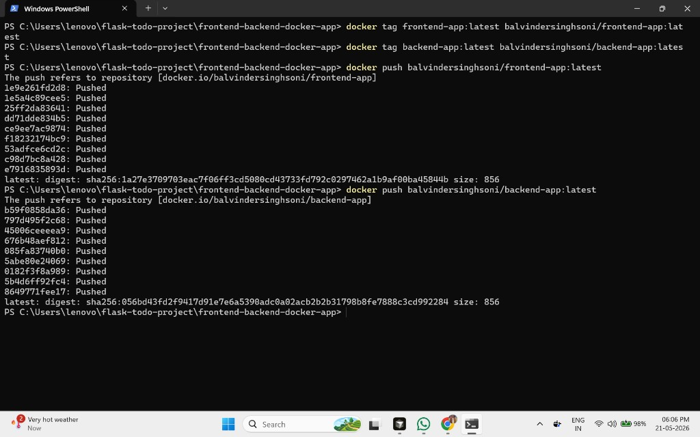

# frontend-backend-docker-app

A beginner-friendly full-stack project with:

- Frontend: Node.js + Express + EJS
- Backend: Flask (Python)
- Containers: Docker + Docker Compose

The frontend provides a form (`name`, `email`, `message`) and sends data to Flask backend.  
The backend returns a JSON response that is shown on the frontend page.

---

## 1) Project Structure

```text
frontend-backend-docker-app/
├── frontend/
│   ├── views/
│   │   └── index.ejs
│   ├── public/
│   │   └── styles.css
│   ├── package.json
│   ├── server.js
│   ├── Dockerfile
│   └── .dockerignore
├── backend/
│   ├── app.py
│   ├── requirements.txt
│   ├── Dockerfile
│   └── .dockerignore
├── docker-compose.yml
├── .gitignore
└── README.md
```

---

## 2) Run Locally (Without Docker)

### Step A: Start Flask backend

```bash
cd backend
python -m venv venv
source venv/bin/activate   # On Windows PowerShell: .\venv\Scripts\Activate.ps1
pip install -r requirements.txt
python app.py
```

Backend runs on: [http://localhost:5000](http://localhost:5000)

### Step B: Start Express frontend (new terminal)

```bash
cd frontend
npm install
set BACKEND_URL=http://localhost:5000/submit   # Windows PowerShell: $env:BACKEND_URL="http://localhost:5000/submit"
npm start
```

Frontend runs on: [http://localhost:3000](http://localhost:3000)

---

## 3) Run With Docker Compose

From project root:

```bash
docker compose up --build
```

Services:

- Frontend: [http://localhost:3000](http://localhost:3000)
- Backend: [http://localhost:5000](http://localhost:5000)

Stop containers:

```bash
docker compose down
```

### Docker Networking Note

Inside Docker Compose, frontend talks to backend using service name:

`http://backend:5000/submit`

This is already configured in `docker-compose.yml` using `BACKEND_URL`.

---

## 4) GitHub Commands (Step-by-Step)

```bash
git init
git add .
git commit -m "Initial full-stack frontend-backend Docker setup"
git branch -M main
git remote add origin <repo-url>
git push -u origin main
```

---

## 5) Docker Hub Commands (Step-by-Step)

Replace `<dockerhub-username>` with your Docker Hub username.

### Login

```bash
docker login
```

### Build images

```bash
docker build -t frontend-app:latest ./frontend
docker build -t backend-app:latest ./backend
```

### Tag images

```bash
docker tag frontend-app:latest <dockerhub-username>/frontend-app:latest
docker tag backend-app:latest <dockerhub-username>/backend-app:latest
```

### Push images

```bash
docker push <dockerhub-username>/frontend-app:latest
docker push <dockerhub-username>/backend-app:latest
```

### If push fails with `insufficient_scope`

1. Make sure you are logged in with the correct Docker Hub account:

```bash
docker logout
docker login
```

2. Create these repositories in Docker Hub UI (if not already created):
   - `<dockerhub-username>/frontend-app`
   - `<dockerhub-username>/backend-app`

3. Push again:

```bash
docker push <dockerhub-username>/frontend-app:latest
docker push <dockerhub-username>/backend-app:latest
```

---

## 6) API Contract

### Endpoint

`POST /submit`

### Request Body (JSON)

```json
{
  "name": "John Doe",
  "email": "john@example.com",
  "message": "Hello from frontend"
}
```

### Response Body (JSON)

```json
{
  "status": "success",
  "message": "Form submitted successfully",
  "data": {
    "name": "John Doe",
    "email": "john@example.com",
    "message": "Hello from frontend"
  }
}
```

---

## 7) Screenshots

### Docker Compose Build and Run



### Running Containers (`docker ps`)



### GitHub Repository



### Docker Build Details (Backend)



### Docker Build Details (Frontend)



### Docker Login + Frontend Build (Latest)



### Docker Backend Build (Latest)



### Docker Hub Push Success (Frontend + Backend)



---

## 8) Production-Readiness Notes

- Dockerfiles use lightweight base images (`node:18-alpine`, `python:3.11-slim`).
- Frontend uses environment variable for backend URL.
- Clear separation between frontend and backend services.
- Beginner-friendly and fully commented source code.

---

## 9) Live Links

- GitHub Repository: [balvindersingh07/frontend-backend-docker-app](https://github.com/balvindersingh07/frontend-backend-docker-app)
- Docker Hub Frontend: [docker.io/balvindersinghsoni/frontend-app](https://hub.docker.com/r/balvindersinghsoni/frontend-app)
- Docker Hub Backend: [docker.io/balvindersinghsoni/backend-app](https://hub.docker.com/r/balvindersinghsoni/backend-app)

---

## 10) Final Submission Checklist

- [x] Full-stack frontend + backend project created
- [x] Dockerfiles for both services added
- [x] Docker Compose network communication configured (`backend` service name)
- [x] `.gitignore` configured for non-required files
- [x] GitHub repository pushed
- [x] Docker Hub images pushed
- [x] Screenshots added to `screenshots/` folder
